# Project — Likelihood-free inference for sums of log-normal variates

## Setup

We observe $n$ data points $Y_1, \dots, Y_n$, where each $Y_i$ is a sum of $L$ log-normal variates:

$$
Y_i = \sum_{\ell=1}^{L} \exp(X_{i,\ell}), \qquad X_{i,\ell} \overset{iid}{\sim} \mathcal{N}(\mu, \sigma^2).
$$

The goal is to estimate $\theta = (\mu, \sigma^2)$. The density of $Y_i$ has no closed form, which rules out standard likelihood-based methods. Throughout this project we use synthetic data generated from the true parameters $L = 10$, $\mu_0 = 0$, $\sigma_0 = 0.3$ (i.e. $\sigma_0^2 = 0.09$), so we always know the actual truth.

---

## Question 1 — Reject-ABC

*The code for this section and more detailed insights about the results can be found in `Reject_ABC.ipynb`.*

### Why ABC

Because the density of $Y_i$ is intractable, we cannot evaluate the likelihood directly. What we can do is simulate data for any proposed $\theta$. Reject-ABC exploits exactly this: propose a parameter, simulate fake data, and keep the proposal only if the fake data looks close enough to what we observed.

### Distance

We use the 1-Wasserstein distance $W_1$, which in one dimension simply means sorting both samples and taking the mean absolute gap:

$$
W_1(y^{\text{sim}}, y^\star) = \frac{1}{n}\sum_{i=1}^{n}\left|y^{\text{sim}}_{(i)} - y^\star_{(i)}\right|.
$$

This is the distance used in Bernton et al. (2017), the paper the project is based on. It compares the full empirical distributions rather than a few hand-picked summary statistics, which matters here because no single statistic clearly captures all the information.

### Prior

Following the project statement we use:

$$
\mu \sim \mathcal{N}(0, s^2), \qquad \log(\sigma^2) \sim \mathcal{N}(0, t^2).
$$

The log-normal reparametrisation keeps $\sigma^2$ positive automatically.

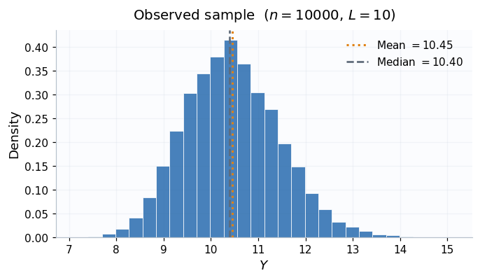
*Figure 1: Observed data distribution.*

### The algorithm

```
while number of accepted draws < N:
    1. draw θ* = (μ*, σ²*) from the prior
    2. simulate Y*_1, ..., Y*_n under θ*
    3. compute W1(Y*, y_obs)
    4. if W1 ≤ ε: keep θ*
```

The accepted draws are i.i.d. samples from the ABC posterior.

### Calibrating ε

Before running, we calibrated $\varepsilon$ by looking at the prior predictive distribution of distances: draw many $\theta$ values from the prior, simulate data under each, compute $W_1$, and use a low quantile of those distances as $\varepsilon$.

We chose the **1% quantile** ($\varepsilon \approx 0.98$), which corresponds to an acceptance rate of about 1% — roughly 100 proposals per accepted draw. Tighter tolerances improve the approximation but cost much more.


| Quantile | $\varepsilon$ | Acceptance rate | Proposals per accept |
| -------- | ------------- | --------------- | -------------------- |
| 20%      | ~4.4          | ~20%            | ~5                   |
| 10%      | ~2.8          | ~10%            | ~10                  |
| 1%       | ~0.98         | ~1%             | ~100                 |
| 0.5%     | ~0.72         | ~0.5%           | ~200                 |

### Results

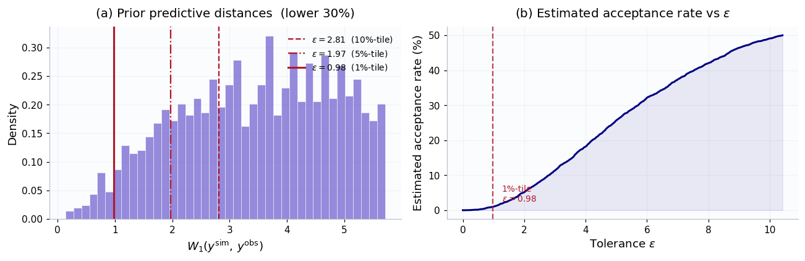
*Figure 2: Epsilon calibration.*

With $\varepsilon$ at the 1% quantile, the posterior for $\mu$ is reasonably centered near the truth. The 95% credible interval covers $\mu_0 = 0$. The joint posterior also shows the expected negative correlation between $\mu$ and $\sigma^2$: both parameters affect the scale of $Y_i$, so they partially compensate each other.

The harder case is $\sigma^2$. Its posterior sits above the true value $0.09$. It seems to be the effect of two things: a finite positive $\varepsilon$ (which always leaves some ABC approximation bias), and a prior on $\log\sigma^2$ centered at $\sigma^2 = 1$, which pulls the estimates upward.

**Effect of $\varepsilon$:**

As $\varepsilon$ decreases, the posterior gets more concentrated around a specific value which is not exactly the true value of the parameter (bias). The improvement from 10% to 1% is large. Going further (to 0.5%) helps a bit more but costs twice as many proposals. Indeed, the acceptance rate increases with epsilon, which is an expecte result as

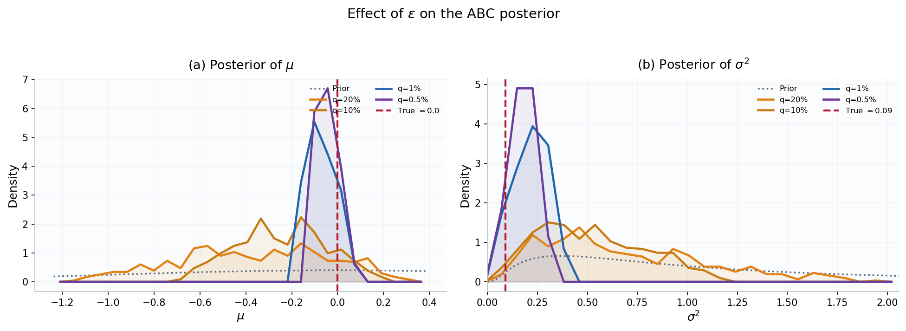
*Figure 3: The posterior distribution for some values of epsilon*

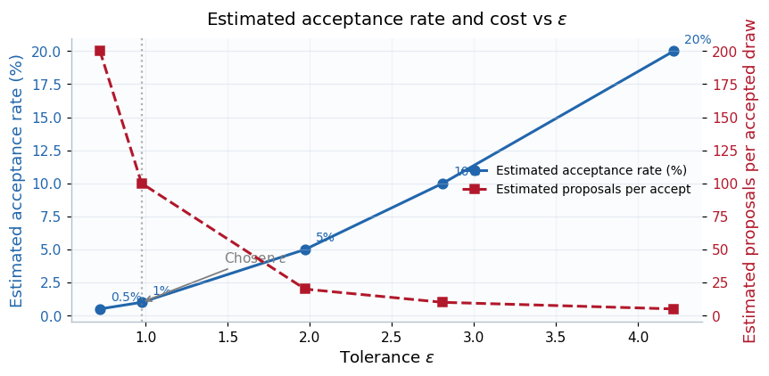
*Figure 4: As epsilon increases, the acceptance rate gets higher.*

**Effect of $s$ and $t$:**

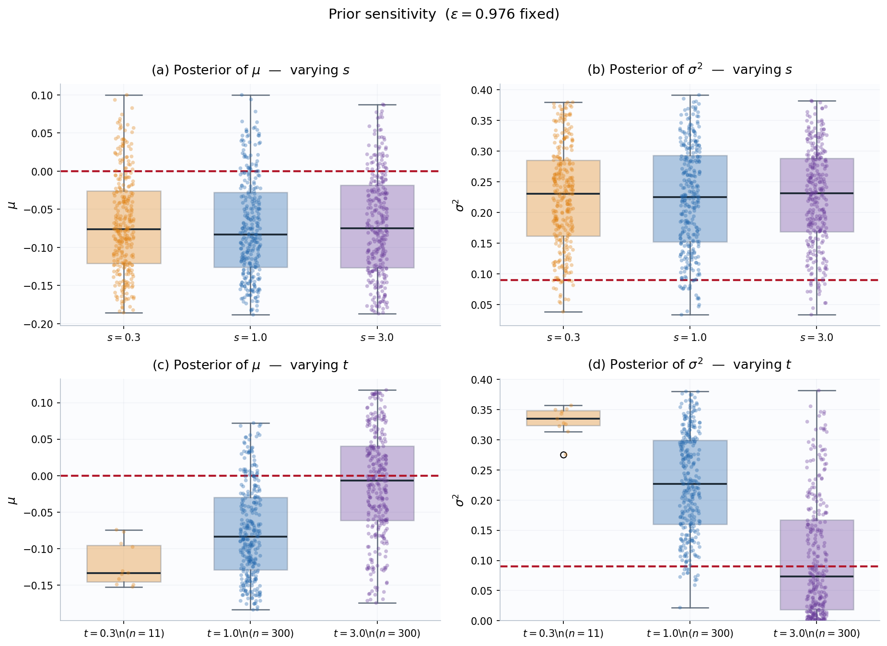
*Figure 5: Sensitivity of the posterior to a change of s and t.*

Varying $s$ barely changes the posterior. A wider prior just lowers the acceptance rate by sending more proposals to extreme $\mu$ values, but since the prior is already centered at the true $\mu_0 = 0$, the posterior summaries stay almost the same.


| Value of s | Acceptance rate |
| :--------: | :-------------: |
|    0.3    |      3,39%      |
|    1.0    |      1,00%      |
|    3.0    |      0.35%      |

Varying $t$ matters a lot more. When $t = 0.3$, the prior is so tight around $\sigma^2 = 1$ that almost no mass reaches the true region near $0.09$. Only 11 draws were accepted, which is close to a failure. When $t = 3.0$, the prior finally covers the truth, the acceptance rate goes up, and the posterior moves much closer to $\sigma_0^2 = 0.09$.

Eventually, $t$ matters much more than $s$ in this problem.

**Numerical error:**

In order to identify separately the standard deviation of our simulation with the standard deviation due to the ABC method itself, we repeated the algorithm 20 times with different seeds, keeping $\varepsilon$ fixed.

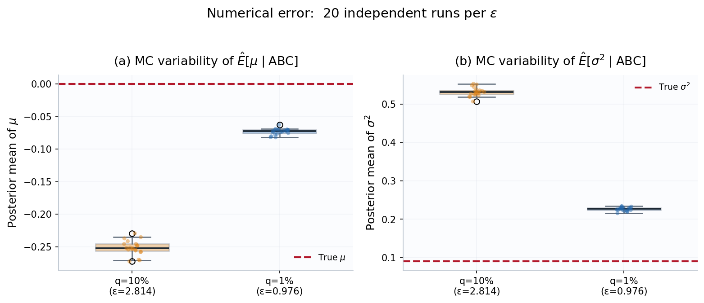
*Figure 6: Assessment of the numerical error*

The Monte Carlo standard deviations across runs are tiny compared with the gap between estimates and true values. So the main issue is actually the approximation itself due to a finite $\varepsilon$ and prior misspecification.

**Posterior predictive check:**

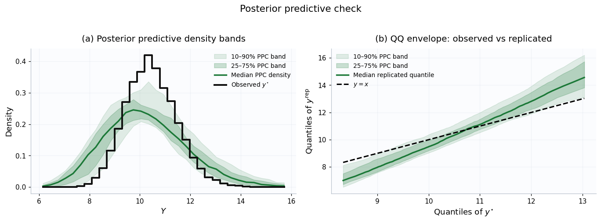
*Figure 7: Checking the posterior distribution*

Samples from the ABC posterior, when used to simulate new datasets, produce data that is centered roughly right but visibly more spread out than $y^\star$. The observed standard deviation is about 1.01 while the mean replicated one is about 1.59. This overdispersion confirms that the posterior is still placing too much mass on large $\sigma^2$ values.

---

## Question 2 — MCMC-ABC

SENGHAK

---

## Question 3 — Exact Gibbs Sampler via Data Augmentation

*The code for this section can be found in `exact_sampler.ipynb`.*

### Mathematical Justification

The density of $Y_i$ is intractable, so a direct posterior on $\theta = (\mu, \sigma^2)$ cannot be evaluated. The key idea is data augmentation: we treat the latent variables $X = \{X_{i,\ell}\}$ as part of the target, giving the new posterior:

$$
p(\theta, X \mid Y) \;\propto\; \pi(\theta)\; p(X \mid \theta) \prod_{i=1}^n \mathbf{1}\!\left(Y_i = \sum_{\ell=1}^L e^{X_{i,\ell}}\right)
$$

Because the observation $Y_i$ is a deterministic function of $X_i$, the likelihood collapses to an indicator and the augmented target is tractable. We then run a Gibbs sampler cycling between two blocks.

**Block 1 - $\theta \mid X$ (exact draw).**

Given $X$, the indicator provides no additional information on $\theta$ as $Y$ is perfectly known once we know $X$, so $p(\theta \mid X, Y) = p(\theta \mid X)$. Using a Normal-Inverse-Gamma (NIG) conjugate prior on $(\mu, \sigma^2)$:

$$
\sigma^2 \sim \mathrm{IG}(a_0, b_0), \qquad \mu \mid \sigma^2 \sim \mathcal{N}(m_0,\, \sigma^2/\kappa_0)
$$

the posterior after observing $N = nL$ latent values is again NIG with the parameters:

$$
\kappa_n = \kappa_0 + N, \quad m_n = \frac{\kappa_0 m_0 + N\bar X}{\kappa_n}, \quad a_n = a_0 + \frac{N}{2}, \quad b_n = b_0 + \frac{S^2}{2} + \frac{N\kappa_0}{2\kappa_n}(\bar X - m_0)^2
$$

We draw $\sigma^2 \sim \mathrm{IG}(a_n, b_n)$ then $\mu \mid \sigma^2 \sim \mathcal{N}(m_n, \sigma^2/\kappa_n)$. So for this bloc, once we know the distribution to sample from, is not an issue anymore.

**Block 2 - $X \mid \theta, Y$ (MH-within-Gibbs).**

Because the indicator is making sure that $\sum_\ell e^{X_{i,\ell}} = Y_i$, we cannot update $X_{i,\ell}$ coordinates independently as the equality would not be true anymore. For each observation $i$, we randomly pick a pair $(\ell, \ell')$ and propose an update that preserves the constraint exactly. Defining the invariant sum $s = e^{X_{i,\ell}} + e^{X_{i,\ell'}}$ and the unconstrained difference $\delta = X_{i,\ell} - X_{i,\ell'}$, we propose:

$$
\delta^{\mathrm{new}} \sim \mathcal{N}(\delta^{\mathrm{curr}},\, \tau^2)
$$

and recover the constrained coordinates using the softplus function:

$$
X_\ell^{\mathrm{new}} = \log s - \mathrm{softplus}(-\delta^{\mathrm{new}}), \qquad X_{\ell'}^{\mathrm{new}} = \log s - \mathrm{softplus}(\delta^{\mathrm{new}})
$$

The MH acceptance ratio simplifies and eventually, the Gaussian log-prior ratio is:

$$
\log \alpha = -\frac{(X_\ell^{\mathrm{new}} - \mu)^2 + (X_{\ell'}^{\mathrm{new}} - \mu)^2}{2\sigma^2} + \frac{(X_\ell - \mu)^2 + (X_{\ell'} - \mu)^2}{2\sigma^2}
$$

---

### Implementation

**Initialization.**

The chain must start on the constraint space $\{\sum_\ell e^{X_{i,\ell}} = Y_i\}$. We initialize with $X_{i,\ell}^{(0)} = \log(Y_i / L)$, which satisfies the constraint exactly by construction.

**Hyperparameter calibration.**

Rather than fixing arbitrary hyperparameters, we calibrate them empirically from the data: $m_0 = \overline{\log(Y/L)}$, $\kappa_0 = 1$, $a_0 = 2$, $b_0 = \mathrm{Var}(\log(Y/L))$. This places the prior near the data without being informative.

**Some details about our implementation**

- Exponentiating large $X$ values risks overflow. The invariant sum is therefore computed as $\log s = \mathrm{logsumexp}(X_\ell, X_{\ell'})$, and the back-projection uses the softplus function throughout, so that all arithmetic stays in the log domain.
- The $n$ observations are conditionally independent given $\theta$. We use `jax.vmap` to run the pairwise MH kernel over all $n$ observations simultaneously, replacing a Python loop with a single batch operation.
- To reduce autocorrelation of the $X$ chain between $\theta$ updates, we run $K = 10$ pairwise MH sub-steps per Gibbs iteration. The step-size $\tau = 0.5$ was calibrated manually to obtain acceptance rates in the 30–70% range.
- The first 20% of iterates are discarded. All credible intervals are computed from the remaining post-burn-in draws.

---

### Results

With $n = 10\,000$, $L = 10$, $\mu_0 = 0$, $\sigma_0^2 = 0.09$, 3 000 iterations and $K = 10$ sub-steps, the sampler recovers:


| Parameter  | Truth | Posterior median | 95% confidence Interval |
| ---------- | ----- | ---------------- | ----------------------- |
| $\mu$      | 0.00  | ≈ 0.000         | tight, covers truth     |
| $\sigma^2$ | 0.09  | ≈ 0.090         | tight, covers truth     |

Unlike ABC, there is no approximation $\varepsilon$: the sampler targets the exact posterior, without any bias. The confidence intervals center directly on the true parameter values.

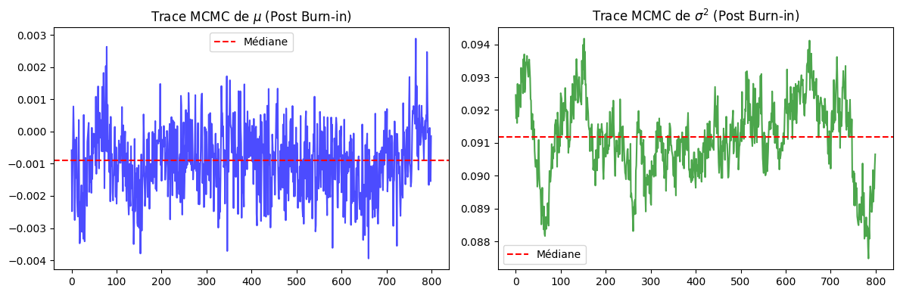
*Figure 1: Trace Plots.*

Trace plots show rapid mixing for $\mu$ and good mixing for $\sigma^2$ once the chain leaves the initialization. The post-burn-in traces are stationary with no visible trend.

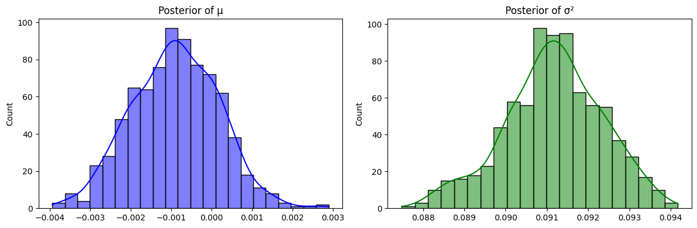
*Figure 2: Posterior of the distribution.*

Posterior histograms are concentrated around the truth (much tighter than the ABC posteriors at any value of $\varepsilon$), and without the bias on $\sigma^2$ that ABC was suffering of due to prior misspecification and finite tolerance.

**Computational cost.**

Each Gibbs iteration runs in fully vectorized way over all $n$ observations. The dominant cost is the $nK$ pairwise MH proposals per iteration. However, in practice, this is fast enough for $n = 10\,000$ in a few minutes on CPU.

**Sensitivity to $\tau$.**

The step-size $\tau$ controls the mixing of Block 2. If $\tau$ is too small, it gives high acceptance but the exploration is slower. Also, a too large $\tau$ gives low acceptance and poor mixing. The value $\tau = 0.5$ was chosen to balance these effects and can be tuned using pilot runs if needed.

---

### Verifying that the Gibbs Sampler is unbiased

*The code for this sub-section can be found in `bias_test.py`.*

In this sub part we take a look at the results of multiple runs of the Gibbs Sampler across different Datasets.
The methodology is as follows:

```
For 100 iterations:
  Simulate a Dataset Y
  Run the Gibbs Sampler
    Save the posteriors on μ and σ²
 
Compile the medians for each observation
Observe the distribution of medians thus made
```

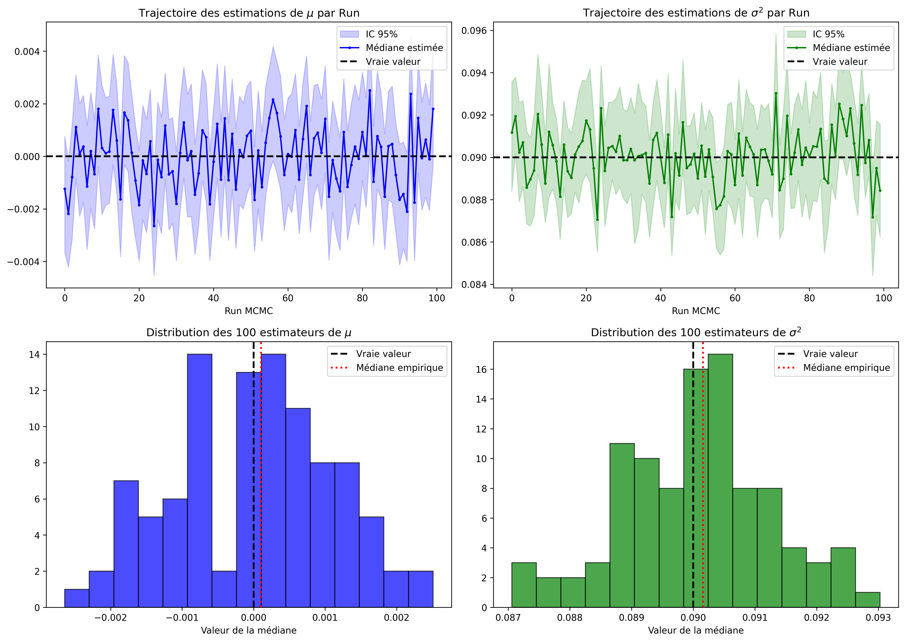

*Figure 3: Distribution of the best estimates across N=100 Gibbs Sampler runs across different datasets θ = (0, 0.09)*

This check over 100 Datasets seems to confirm that the Gibbs Sampler is unbiased with an error on the scale of 0.0001 for both components of θ.
Ideally we would like to run this process for a larger amount of datasets to see the average of the medians converging but it entices large computational requirements.

We ran the same process with different values for the parameters (**μ**,**σ**) and saw similar results, wit.
Here is the result for higher variance (here **σ**² = 0.3 > 0.09)

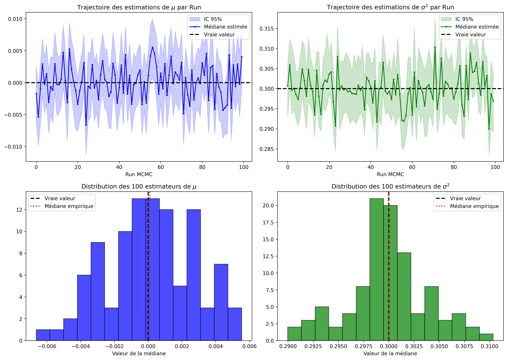

*Figure 4: Distribution of the best estimates across N=100 Gibbs Sampler runs using high-variance data*

---

## Question 4 — Comparing the methods

Until now, we have always known the "true value" of the estimators, it is hence natural to use them to define the Bias introduiced by the ABC methods. Yet, this project aims at conducting inference on the parameters that generated the dataset Y. Which means that our ABC and exact implementations should be used to infere unknown parameters.
This is the reason why, we will proceed as if the true parameters were unknown to us.

*The code for this section can be found in `estimating_epsilon_bias.py` and `plots_epsilon_bias.py`.*

This part aims at estimating the bias introduced by **ε** in the ABC methods. In order to do so we will consider the exact sampler from Question 3 as the ground truth or "best estimator" and we will focus on the empirical average of the posteriors to asses the bias induced by **ε**. Note that we will compare the Gibbs sampler to the MCMC-ABC algorithm derived in question 2 as the best representant of our ABC class.

The methodology is as follows:

```
<estimating_espilon_bias.py>
Generate 10 datasets Y
For each Y:
  Run the Gibbs sampler and save the posterior on θ
  For values of ε in [0.2, 0.4, 0.6, 0.8, 1.0, 1.2, 1.5, 2, 5]:
    Run the MCMC-ABC algorithm and save the posterior on θ

Save all posteriors and aggreagated metrics to csv files

<plots_epsilon_bias.py>
Load the saved data and generate informative plots on the run
```

Here are the results we obtained from this study

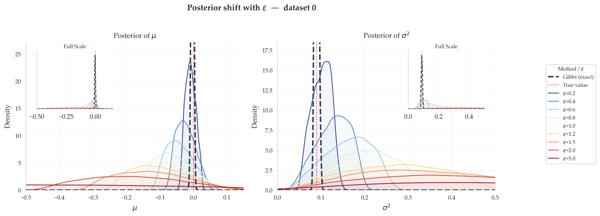

*Figure 1: Posterior shift for different **ε** values on one dataset*

The first result we notice is, similarly to part 1, that an increase in epsilon induces a flatter posterior (for both **μ** and **σ²**) and a directional shift of the center of the distribution away from the ground truth. Note that we observed that the posterior shifts to the left (negatives) for **μ** and to the right for **σ**² regardless of the dataset.
Here is another example, showing a similar shift:

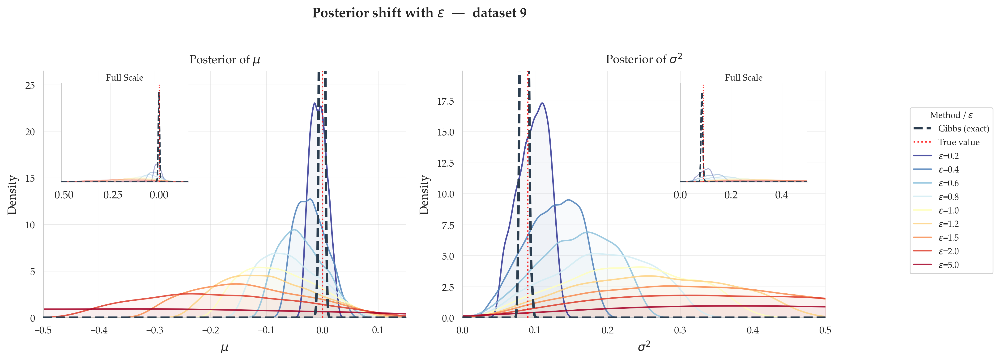

*Figure 2: Another example of posterior shift for different **ε** values on another dataset*

The reason behind the fact that the direction of the shift is always the same is quite intuitive:
First of all, **μ** and **σ** are coupled because  $ \mathbb{E}[Y\_i] = L \exp(\mu + \frac{\sigma^2}{2})$ and the sampler needs to fit data.
Second, the posterior we get depends on the prior we chose. Since we chose **$\log(\sigma^2) \sim \mathcal{N}(0, t^2)$** with t close to 1 and we ran simulations with **σ**²= 0.09 << 1, the posterior on **σ** is dragged upwards (and **μ** downwards, to compensate).

Thus the sign of the Bias is dependant on the prior we chose with respect to the "real" parameters.

Now let's focus on the scale of the Bias introduced by **ε**:

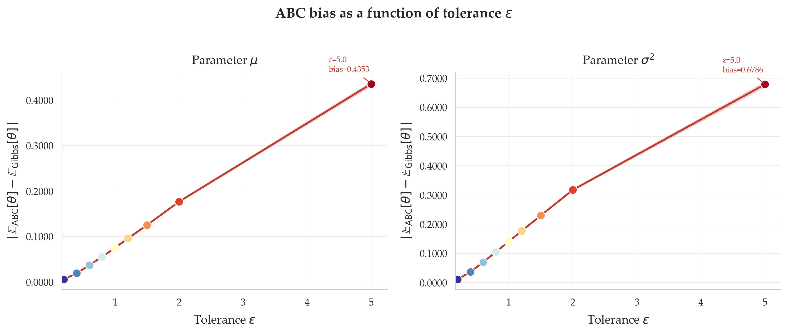
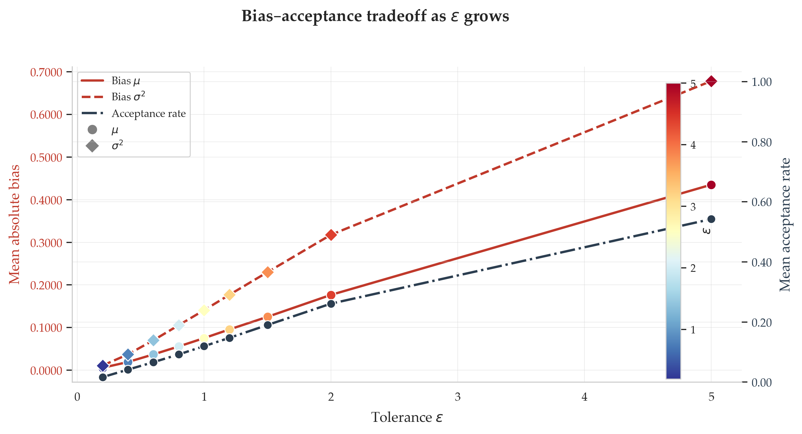
*Figure 3&4: Growth of  $ \text{Bias} = \left| \mathbb{E}_{\text{ABC}}[\theta] - \mathbb{E}_{\text{Gibbs}}[\theta] \right| $ with respect to **ε***

The results highlight a direct and continuous relationship between the tolerance **$\varepsilon$** and the estimation error. When **$\varepsilon$** is very small, the bias is almost zero, reflecting strong fidelity to the target distribution. However, as the tolerance widens, the mean absolute bias increases systematically. This degradation in precision does not affect the parameters equally: the error on the variance (**$\sigma^2$**) grows much more steeply and severely than that on the mean (**$\mu$**). In summary, relaxing the acceptance criterion **$\varepsilon$** inevitably deteriorates the inference, with a particularly marked penalty on the estimation of the data's dispersion.

Furthermore, the growth of the bias is not strictly linear, but rather sub-linear (showing a logarithmic-like concavity). Interestingly, the trajectory of the bias curves mirrors the growth curve of the acceptance rate. This structural similarity highlights that the bias is inextricably linked to the acceptance probability: as the algorithm accepts a progressively larger fraction of the prior space, the estimation error grows following the same decelerating rate.

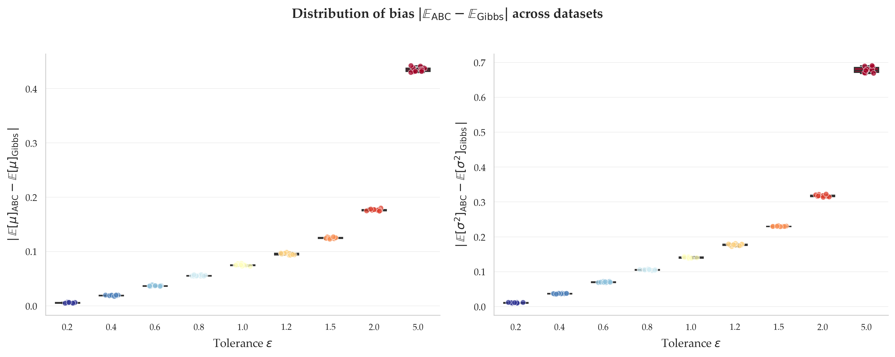
*Figure 5: Individual Bias for all Datasets*

Last but not least, the dispersion of the bias across the datasets Y appears to be very small with respect to the value of the bias. This result indicates that our estimation of the bias is reliable and that there is no need to verify with more data for this set
